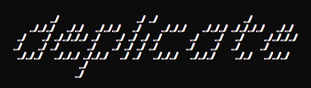

<b>Advanced Duplicate File Finder for Python.</b> <i>Nothing is impossible to solve.</i>

Table of contents
-----------------

- [Status](#status)
- [Description](#description)
- [Features](#features)
- [Installation](#installation)
- [Usage](#usage)
  - [Quick Examples](#quick-examples)
  - [Advanced Examples](#advanced-examples)
- [API Reference](#api-reference)
  - [Properties](#properties)
  - [Methods](#methods)

Status
------

Description
-----------

Use **deplicate** to find out all the duplicated files in one or more
directories, you can also scan a bunch of files directly.

**deplicate** is written in Pure Python and requires just a couple
of dependencies to work fine, depending on your system.

From what all we know, it's the most advanced and fastest duplicates finder
tool for Python, nowadays.

Features
--------

- [x] Optimized for speed
- [x] N-tree layout for low memory consumation
- [x] Multi-threaded (partially)
- [x] Raw drive data access to maximize I/O performances (Unix only)
- [x] xxHash algorithm for fast file identification
- [x] File size and signature checking for quick duplicate exclusion
- [x] Extended file attributes scanning
- [x] Multi-filtering
- [x] Full error handling
- [x] Unicode decoding
- [x] Safe from recursion loop
- [ ] SSD detection (implemented, but not yet used)
- [ ] Support for moving duplicates to trash/recycle bin
      (implemented, but not yet used)
- [x] Command Line Interface (https://github.com/vuolter/deplicate-cli)
- [x] Structured results
- [ ] Graphical User Interface
- [ ] Incremental file chunk checking
- [ ] Multi-processing
- [ ] Fully documented
- [ ] PyPy support
- [ ] ~~Exif data scanning~~

Installation
------------

Type in your command shell **with _administrator/root_ privileges**:

    pip install deplicate

In Unix-based systems, this is generally achieved by superseding
the command `sudo`.

    sudo pip install deplicate

If the above commands fail, consider installing it with the option
[`--user`](https://pip.pypa.io/en/latest/user_guide/#user-installs):

    pip install --user deplicate

> **Note:**
> You can install **deplicate** with its _Command Line Interface_ typing:
> `pip install deplicate[cli]`

Usage
-----

Import in your python script the new available module `duplicate`
and call its function `find`.

### Quick Examples

> **Note:**
> By default directory paths are scanned recursively.

> **Note:**
> By default files smaller than **100 MiB** are not scanned.

Scan a single directory for duplicates:

    import duplicate

    duplicate.find('/path/to/dir')

Scan more directories together:

    import duplicate

    duplicate.find('/path/to/dir1', '/path/to/dir2', '/path/to/dir3')

Scan from iterable:

    import duplicate

    iterable = ['/path/to/dir1', '/path/to/dir2', '/path/to/dir3']

    duplicate.find.from_iterable(iterable)

Scan ignoring the minimum file size threshold:

    import duplicate

    duplicate.find('/path/to/dir', minsize=0)

Resulting output will be always a list of lists of file paths,
where each list collects together all the same files (aka. the duplicates):

    [
        ['/path/to/dir1/file1', '/path/to/file1', '/path/to/dir2/subdir1/file1]',
        ['/path/to/dir2/file3', '/path/to/dir2/subdir1/file3']
    ]

> **Note:**
> File paths are returned in canonical form.

> **Note:**
> Lists of file paths are sorted in descending order by length.

### Advanced Examples

Scan single files, **not-recursively**:

    import duplicate

    duplicate.find('/path/to/file1', '/path/to/file2', '/path/to/dir1',
                   recursive=False)

> **Note:**
> In _not-recursive mode_, like the case above, directory paths are simply
> ignored.

Scan from iterable checking file names and hidden files:

    import duplicate

    iterable = ['/path/to/dir1', '/path/to/file1']

    duplicate.find.from_iterable(iterable, comparename=True, scanhidden=True)

Scan excluding python files:

    import duplicate

    duplicate.find('/path/to/dir', exclude="*.py")

Scan including symbolic links of files:

    import duplicate

    duplicate.find('/path/to/file1', '/path/to/file2', '/path/to/file3',
                   scanlinks=True)

API Reference
-------------

### Properties

- duplicate.**DEFAULT_MINSIZE**
  - **Description**: Default minimum file size in Bytes.
  - **Value**: `102400`

- duplicate.**MAX_BLKSIZES_LEN**
  - **Description**: Default maximum number of cached block sizes.
  - **Value**: `128`

### Methods

- duplicate.**clear_blkcache**()
  - **Description**: Clear the internal blksizes cache.
  - **Return**: None.
  - **Parameters**: None.

- duplicate.**find**(`paths, minsize=None, include=None, exclude=None,
    comparename=False, comparemtime=False, compareperms=False, recursive=True,
    followlinks=False, scanlinks=False, scanempties=False, scansystems=True,
    scanarchived=True, scanhidden=True, signsize=None, onerror=None`)
  - **Description**: Find duplicate files.
  - **Return**: Nested lists of paths of duplicate files.
  - **Parameters**:
    - `paths` – Iterable of directory and file paths.
    - `minsize` – _(optional)_ Minimum size of files to include in scanning
      (default to `DEFAULT_MINSIZE`).
    - `include` – _(optional)_ Wildcard pattern of files to include in scanning.
    - `exclude` – _(optional)_ Wildcard pattern of files to exclude
      from scanning.
    - `comparename` – _(optional)_ Check file name.
    - `comparemtime` – _(optional)_ Check file modification time.
    - `compareperms` – _(optional)_ Check file mode (permissions).
    - `recursive` – _(optional)_ Scan directory recursively.
    - `followlinks` – _(optional)_ Follow symbolic links pointing to directory.
    - `scanlinks` – _(optional)_ Scan symbolic links pointing to file.
    - `scanempties` – _(optional)_ Scan empty files.
    - `scansystems` – _(optional)_ Scan OS files.
    - `scanarchived` – _(optional)_ Scan archived files.
    - `scanhidden` – _(optional)_ Scan hidden files.
    - `onerror` – _(optional)_ Callback function called with two arguments,
      `exception` and `filename`, when an error occurs during file scanning or
      processing.

------------------------------------------------
###### © 2017 Walter Purcaro <vuolter@gmail.com>
